# The visualisations

Eighteen of them, plus a **None** entry for people who want the player and not
the light show. Every one is Canvas2D — there is no WebGL path, and reinstating
one would reinstate the failure modes that removing it fixed.

All of them read the same [VisualScore](../visualcore/README.md): beats,
downbeats, sections, seven dense lanes and sixteen spectrum bands, indexed by
playback position rather than by the wall clock. That last part is not a detail.
Several people watch one track together, so anything driven by `performance.now`
would sit at a different point for every viewer, keep running through a pause,
and ignore a seek. The test suite renders every visualisation twice over
identical playback positions with wall clocks hours apart and fails if the two
draw different pictures.

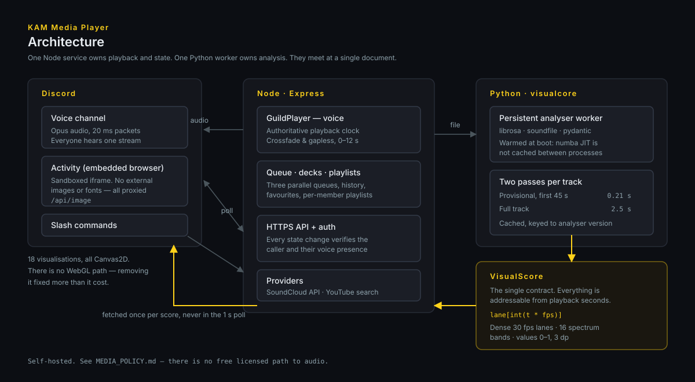

---

## Screenshots

> **Filling this in:** drop a PNG into `docs/img/` using the filename shown
> under each entry. The names are the visualisation IDs from
> `activity/client/registry.js`, so they cannot drift from the code. Anything
> around 1280×720 looks right at this width; the Activity's own window is a good
> source. Delete this note once the grid is populated.

### The two about the track itself

| | |
|:--:|:--:|
| 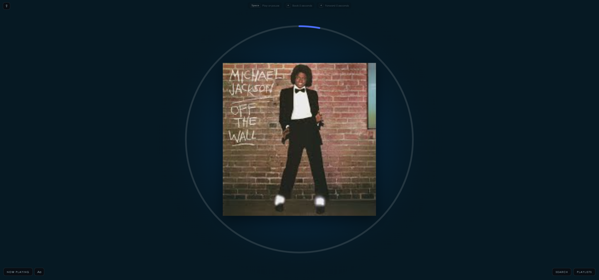 | 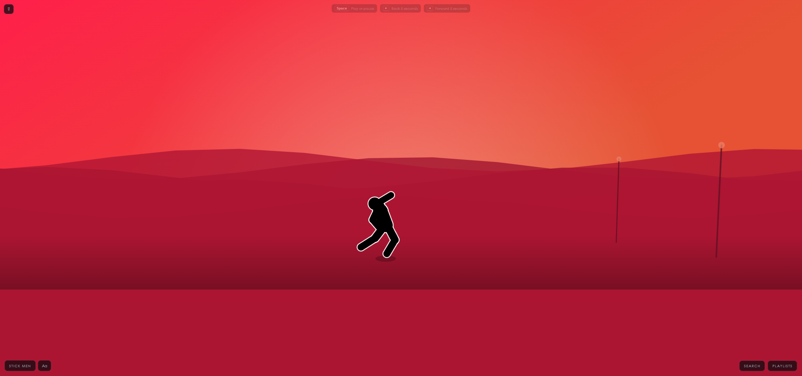 |
| **Now Playing** · `img/nowplaying.png` | **Stick Men** · `img/stickmen.png` |
| Cover, title and progress, for when you want to know what is playing rather than watch something. | Dancing figures under a moving camera. Poses are pure functions of position within the bar, so they cannot drift out of time. |

### Painterly

| | |
|:--:|:--:|
| 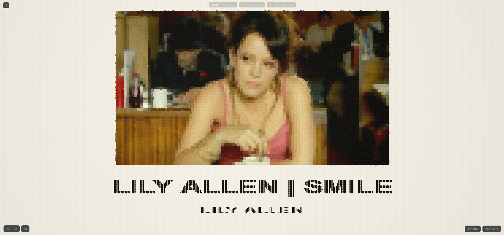 | 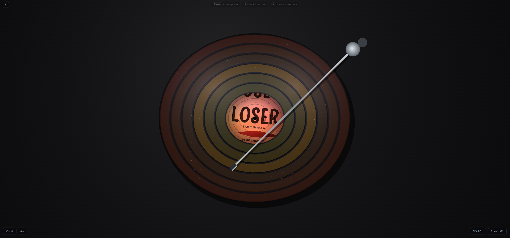 |
| **Painter** · `img/painter.png` | **Vinyl** · `img/vinyl.png` |
| Paints the cover over the length of the track, finishing before it ends. | A record on a turntable. The label is the whole cover, inscribed, with the leftover segments mirrored outward. |
| 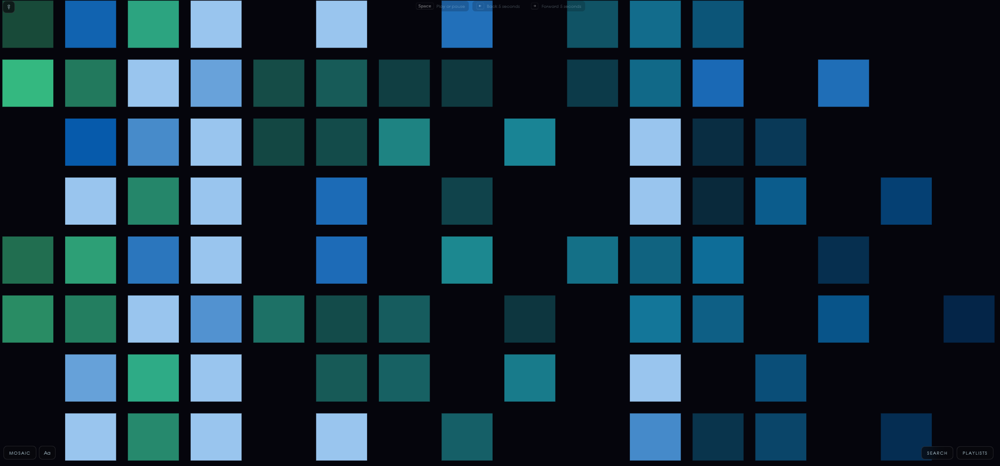 | 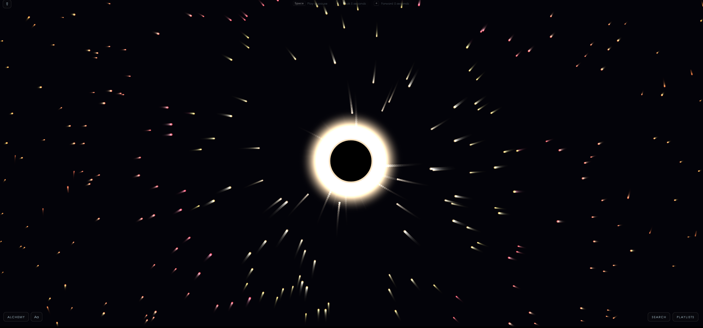 |
| **Mosaic** · `img/mosaic.png` | **Alchemy** · `img/alchemy.png` |
| | |

### Spectrum and waveform

| | |
|:--:|:--:|
| 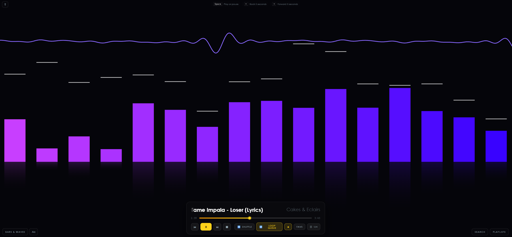 | 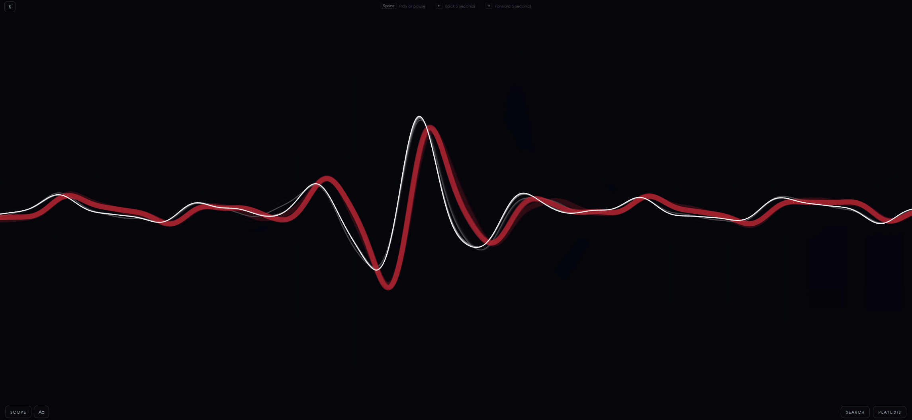 |
| **Bars & Waves** · `img/bars.png` | **Scope** · `img/scope.png` |
| A classic analyser with peak caps and a reflection. | |
| 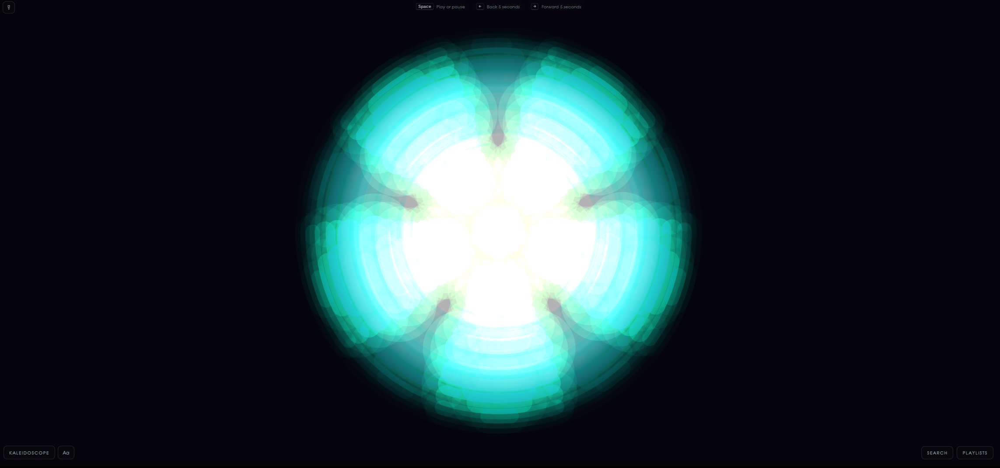 | 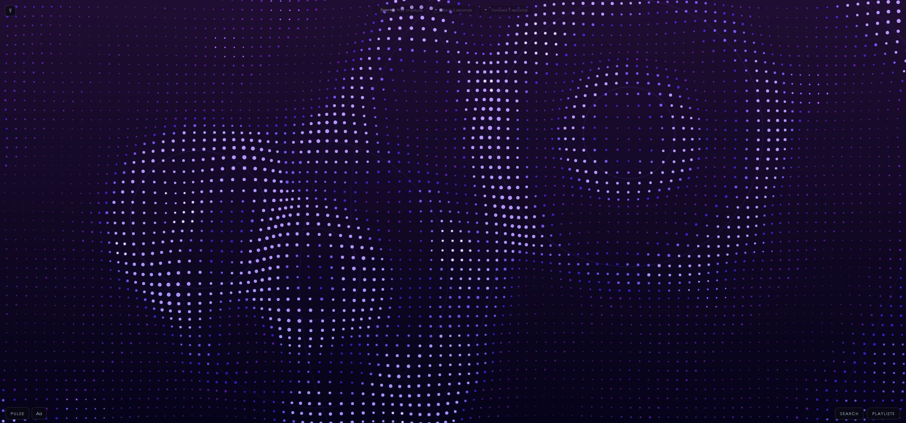 |
| **Kaleidoscope** · `img/kaleidoscope.png` | **Pulse** · `img/pulse.png` |
| One wedge of spectrum geometry mirrored around the centre, blended additively. | |

### Places

| | |
|:--:|:--:|
| 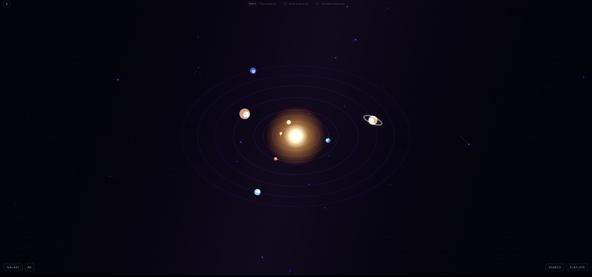 | 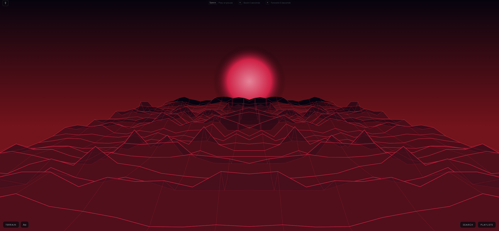 |
| **Galaxy** · `img/galaxy.png` | **Terrain** · `img/terrain.png` |
| | A landscape that builds itself from the spectrum as the track runs. |
| 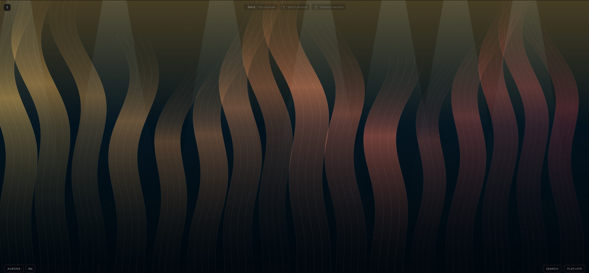 | 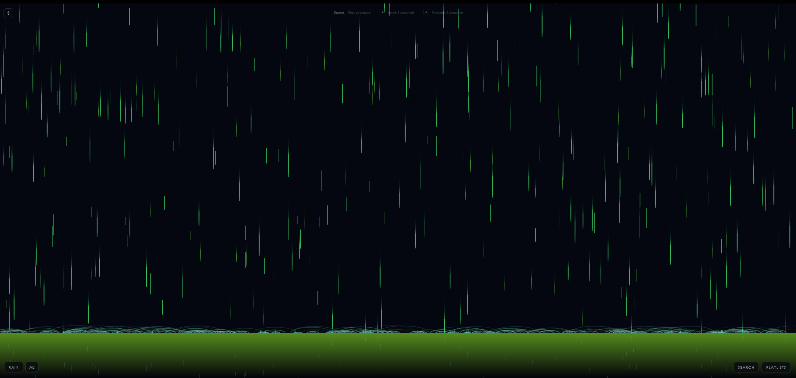 |
| **Aurora** · `img/aurora.png` | **Rain** · `img/rain.png` |
| | Reflected in wet ground. |
| 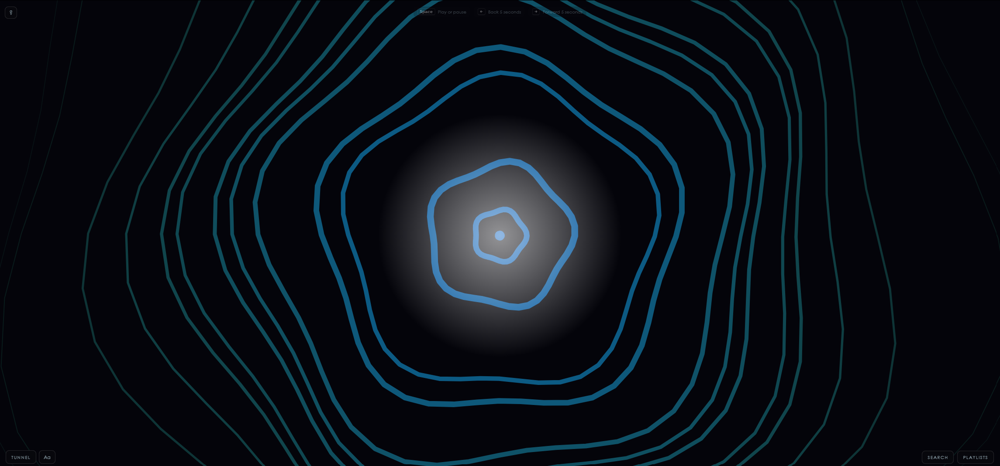 | 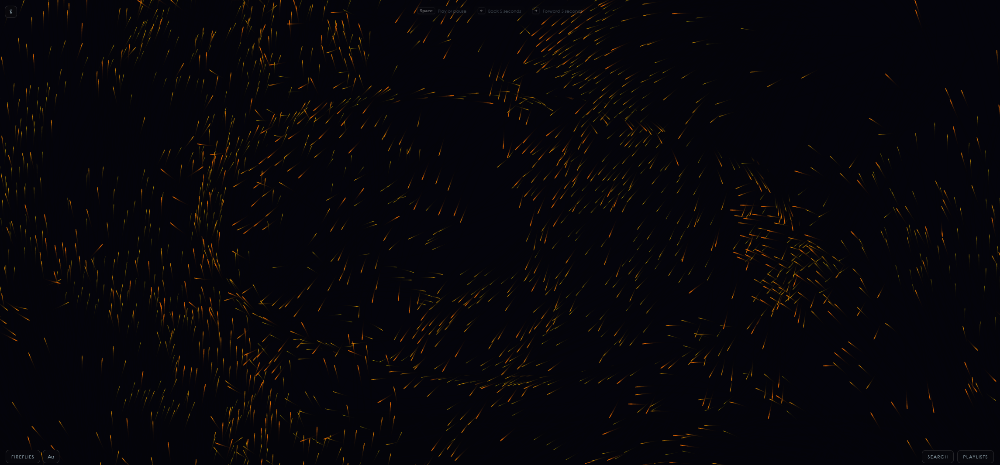 |
| **Tunnel** · `img/tunnel.png` | **Fireflies** · `img/fireflies.png` |
| | |

### Colour and line

| | |
|:--:|:--:|
| 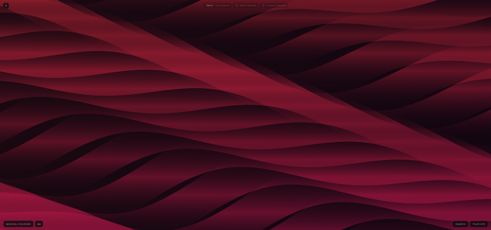 | 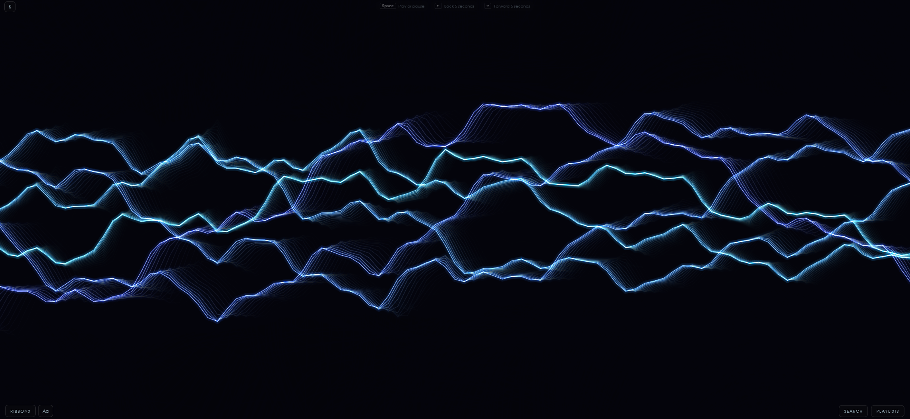 |
| **Musical Colours** · `img/colours.png` | **Ribbons** · `img/ribbons.png` |
| | |

---

## Video

Short clips read far better than stills for the ones that move — Stick Men,
Ribbons, Aurora and Terrain especially. GitHub plays `.mp4` uploaded directly
into a release or an issue comment, but **not** from a repository path in a
README, so link them from the release rather than committing them here.

`Icons/background/` already holds a few recorded loops.
